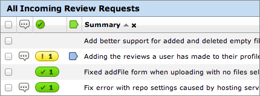
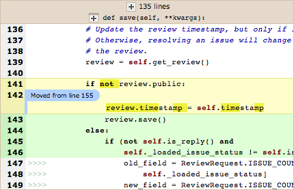
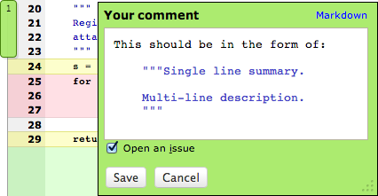
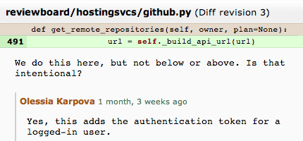

= Review Board介绍
:source-highlighter: highlight.js

== 代码审查

[, Yahoo! Web Search]
""
Review Board 已经改变了代码评审的方式，其可以强迫高质量的代码标准和风格，并可以成为程序员编程的指导者。
当你访问search.yahoo.com 时，其代码都是使用 Review board工具Review过的。
""

[NOTE.speaker]
--
雅虎搜索使用Review Board作为他们的代码审查工具。
--

== Review Board功能概览

是一套用python编写的用于代码审查的Web程序，支持以下的浏览器：

* Firefox 3.0+
* Internet Explorer 9+
* Google Chrome

[data-background="green"]
=== 任务列表

[NOTE.speaker]
--
这里能看到所有的任务
--

[data-background="green"]
=== 文件比较

[data-background="green"]
=== 提交注释

[data-background="green"]
=== Issue汇总

image::img/issue-summary.png[Issue汇总]

[data-background="green"]
=== 历史记录

== 代码评审的两种类型

[%step]
* Pre-commit review
* Post-commit review

[data-background="green"]
=== Pre-commit review

""
在代码提交到代码库之前审查。先往Review Board里上传一个diff文件，这样审查者可用对其进行评论，一旦批准，代码会被提交到代码库中。
""

[data-background="green"]
=== Post-commit review

""
代码先提交到代码库中，在之后的某个时间点进行代码审查。发现的问题修改的代码后需要重新提交到代码库中。
""

[data-background="green"]
=== 优缺点比较

""
pre-commit 的好处是在代码入库前就能发现错误，从而避免引起线上产品的问题。缺点就是导致开发时间变长，尤其是在项目紧急的时候比较难贯彻执行。
""

== pre-commit review的流程

. 对已修改的代码创建一个review请求，上传diff文件,发布这个请求
. 等待评审人查看并给出反馈
. 如果评审人提出改进建议，修改本地代码并重新生成diff文件并上传，说明改变的内容，重新发布，跳到第2步
. 如果评审人执行了"Ship it"，那么就提交代码到仓库，关闭并提交这个请求

== DEMO
